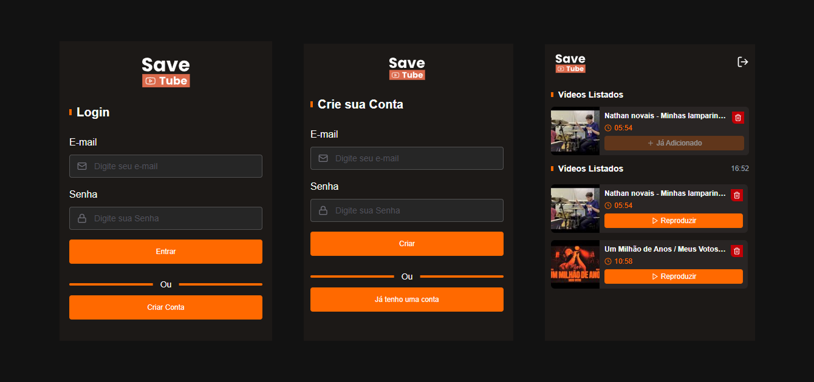

# SaveTube 📋🎥

&nbsp;

## 📚 Informações sobre o projeto

* O projeto se resume em uma extensão para o Google Chrome onde o usuário cria uma conta e consegue salvar vídeos para assistir mais tarde. Todo o desenvolvimento foi feito durante uma [série](https://www.youtube.com/playlist?list=PLY_G6KZ7jlfWmevP7a4jB7x7w1UQScBvx) do canal do [GB Dev](https://www.youtube.com/c/GBDev)

&nbsp;

## 💻 Funcionalidades do projeto

* Sistema de autenticação com Firebase (Crianção de conta/Login);
* Visualização dos detalhes do vídeo que está aberto no momento em seu navegador (usando a API do Youtube);
* Possibilidade de adicionar vídeos a sua lista;
* Possibilidade de remover vídeos de sua lista

&nbsp;

## 🎨 Telas do projeto

&nbsp;

## 🛠️ Tecnologias/Ferramentas utilizadas

* [React](https://react.dev/)
* [TypeScript](https://www.typescriptlang.org/)
* [TailwindCss](https://tailwindcss.com/)
* [Firebase](https://firebase.google.com/)
* [React Hook Form](https://react-hook-form.com/)
* [Vite](https://vitejs.dev/)

&nbsp;

---

Feito com 🧡 por <a href="https://jhonatas-portfolio.vercel.app/">Jhonatas Micael</a>

